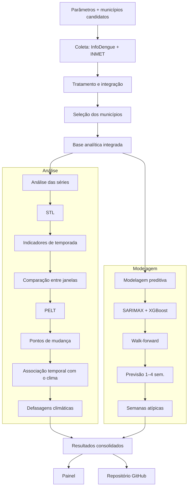

# Etapa 2 — Pipeline da Solução

## Pipeline da Solução

A solução compreende etapas de coleta e tratamento dos dados, análise das séries temporais, avaliação da relação com variáveis climáticas, modelagem preditiva e consolidação dos resultados no painel interativo.

## Etapas do pipeline

| Etapa | Função | Saída |
|---|---|---|
| **1. Entrada** | Definir municípios candidatos (código IBGE), doenças, período e parâmetros analíticos, como limiar P75, mínimo de semanas consecutivas, penalidade do PELT e defasagens. | Arquivo de configuração |
| **2. Coleta** | Consultar a API do InfoDengue para dengue, zika e chikungunya e, quando houver lacunas ou inconsistências relevantes, consultar dados do INMET. | Dados brutos por município e doença |
| **3. Tratamento** | Auditar a completude, diferenciar valores zero de dados ausentes, padronizar a semana epidemiológica, interpolar somente variáveis climáticas, calcular incidência, integrar os dados epidemiológicos e climáticos e criar as defasagens. **Nesta etapa ocorre a seleção final dos municípios.** | Base analítica integrada e relatório de completude |
| **4. Análise das séries** | Aplicar decomposição STL, calcular indicadores de temporada, comparar janelas temporais e aplicar o PELT para identificação de possíveis pontos de mudança. | Indicadores de temporada e pontos de mudança |
| **5. Associação com o clima** | Avaliar a relação temporal entre as mudanças observadas nas séries epidemiológicas e as variáveis climáticas, considerando diferentes defasagens. | Resultados das associações entre clima e casos |
| **6. Modelagem preditiva** | Aplicar SARIMAX e XGBoost para previsão de 1 a 4 semanas, utilizando validação *walk-forward*. | Previsões e métricas de desempenho |
| **7. Identificação de semanas atípicas** | Identificar semanas atípicas a partir dos resíduos dos modelos ou dos intervalos de previsão. | Lista de semanas atípicas |
| **8. Resultados** | Consolidar indicadores, pontos de mudança, associações climáticas, previsões, métricas (MAE, RMSE e sMAPE) e semanas atípicas. | Tabelas e gráficos finais |
| **9. Apresentação** | Organizar os resultados em um painel interativo, com seleção de município e doença, e documentar o projeto no GitHub. | Painel e repositório |

## Fluxo de análise

As etapas 1 a 3 gerarão a base analítica integrada. A partir dela, serão realizadas a decomposição STL, a obtenção dos indicadores de temporada e a detecção de possíveis mudanças com o PELT. Em seguida, essas mudanças serão comparadas às variáveis climáticas considerando diferentes defasagens, sem pressupor causalidade.

Paralelamente, SARIMAX e XGBoost serão utilizados para previsões de 1 a 4 semanas, com validação *walk-forward*. Os resultados incluirão indicadores de temporada, pontos de mudança, associações climáticas, previsões e semanas atípicas, posteriormente consolidados no painel interativo.

## Fluxo da solução

