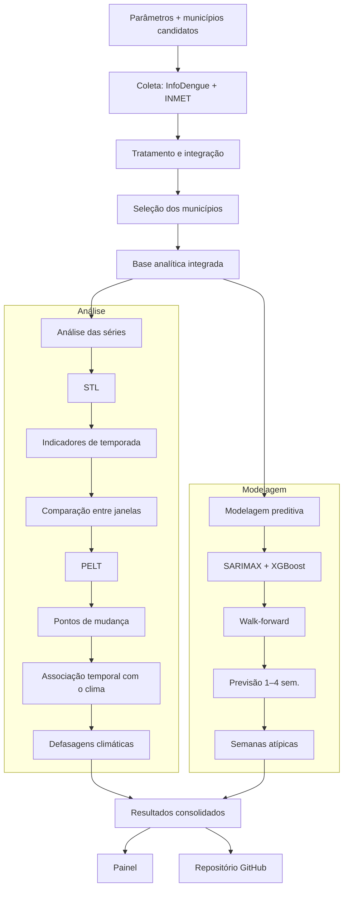

# Etapa 2 — Pipeline da Solução

## Pipeline da Solução

A solução compreende etapas de coleta e tratamento dos dados, análise das séries temporais, avaliação da relação com variáveis climáticas, modelagem preditiva e consolidação dos resultados no painel interativo.

## Etapas do pipeline

| Etapa | Função | Saída |
|---|---|---|
| **1. Entrada** | Definir municípios, doenças, período e parâmetros. | Configuração |
| **2. Coleta** | Coletar dados do InfoDengue e INMET. | Dados brutos |
| **3. Tratamento** | Verificar, padronizar e integrar os dados; selecionar os municípios. | Base integrada |
| **4. Análise das séries** | Aplicar STL, indicadores de temporada e PELT. | Indicadores e pontos de mudança |
| **5. Associação com o clima** | Avaliar relações temporais entre clima e casos, considerando defasagens. | Associações clima-casos |
| **6. Modelagem preditiva** | Aplicar SARIMAX e XGBoost com validação *walk-forward*. | Previsões e métricas |
| **7. Semanas atípicas** | Identificar semanas atípicas pelos modelos. | Semanas atípicas |
| **8. Resultados** | Consolidar análises, previsões e métricas. | Tabelas e gráficos |
| **9. Apresentação** | Organizar resultados no painel e GitHub. | Painel e repositório |

## Fluxo de análise

As etapas 1 a 3 gerarão a base analítica integrada. A partir dela, serão realizadas a decomposição STL, a obtenção dos indicadores de temporada e a detecção de possíveis mudanças com o PELT. Em seguida, essas mudanças serão comparadas às variáveis climáticas considerando diferentes defasagens, sem pressupor causalidade.

Paralelamente, SARIMAX e XGBoost serão utilizados para previsões de 1 a 4 semanas, com validação *walk-forward*. Os resultados incluirão indicadores de temporada, pontos de mudança, associações climáticas, previsões e semanas atípicas, posteriormente consolidados no painel interativo.

## Fluxo da solução

